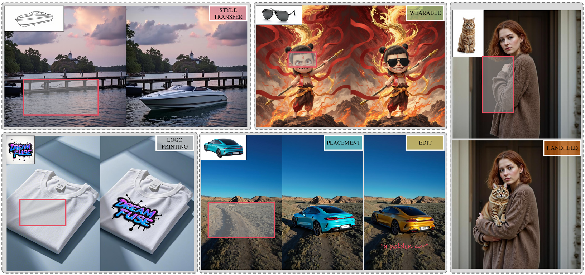
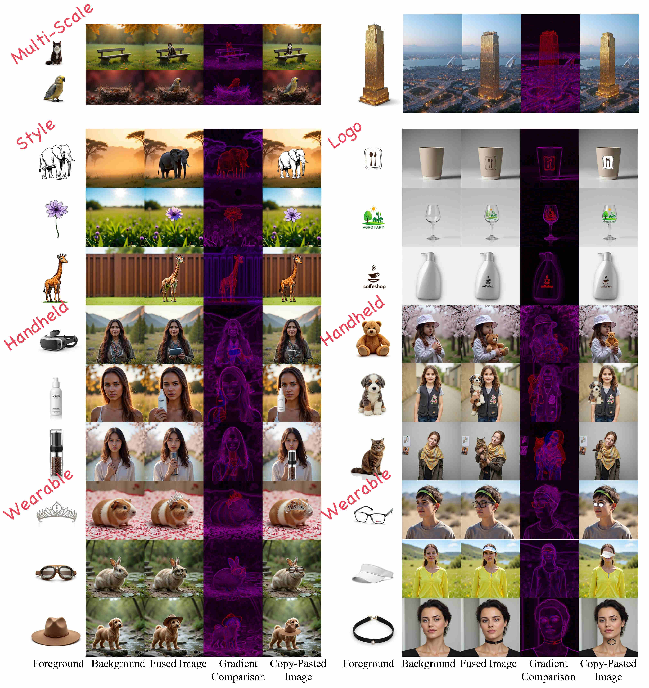
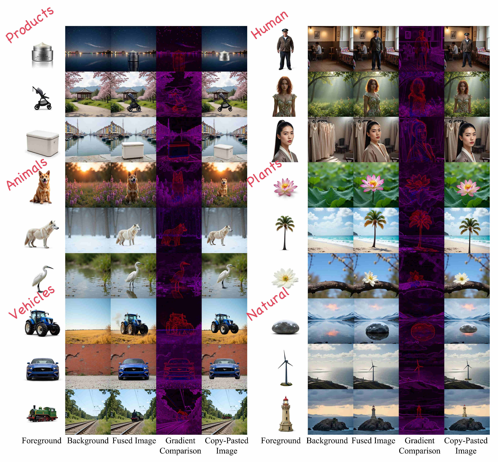

# DreamFuse
Official implementation of **[DreamFuse: Adaptive Image Fusion with Diffusion Transformer](https://ll3rd.github.io/DreamFuse/)**

[](https://arxiv.org/abs/2504.08291) [](https://huggingface.co/spaces/LL3RD/DreamFuse) [](https://huggingface.co/datasets/LL3RD/DreamFuse) [](https://huggingface.co/LL3RD/DreamFuse) <br>




## 🚀 TODO
- [x] Release github repo.
- [x] Release inference code.
- [x] Release training code.
- [x] Release model checkpoints.
- [x] Release arXiv paper.
- [x] Release the dataset.
- [x] Release huggingface space demo.
- [ ] Release the LDPO code.

## 📖 Introduction
Image fusion seeks to seamlessly integrate foreground objects with background scenes, producing realistic and harmonious fused images. Unlike existing methods that directly insert objects into the background, adaptive and interactive fusion remains a challenging yet appealing task. To address this, we propose an iterative human-in-the-loop data generation pipeline, which leverages limited initial data with diverse textual prompts to generate fusion datasets across various scenarios and interactions, including placement, holding, wearing, and style transfer. Building on this, we introduce DreamFuse, a novel approach based on the Diffusion Transformer (DiT) model, to generate consistent and harmonious fused images with both foreground and background information. DreamFuse employs a Positional Affine mechanism and uses Localized Direct Preference Optimization guided by human feedback to refine the result. Experimental results show that DreamFuse outperforms SOTA across multiple metrics.

## 🔧 Dependencies and Installation

```shell
git clone https://github.com/LL3RD/DreamFuse-Code.git
cd DreamFuse
conda create -n DreamFuse python=3.10
conda activate DreamFuse
conda install pytorch==2.5.1 torchvision==0.20.1 torchaudio==2.5.1 pytorch-cuda=12.1 -c pytorch -c nvidia
pip install -r requirements.txt
```

## 📖 Dataset
We propose an iterative Human-in-the-Loop data generation pipeline and construct a comprehensive fusion dataset containing 80k diverse fusion scenarios. Over half of the dataset features outdoor backgrounds, and approximately 23k images include hand-held scenarios.

<p align="center">
  
</p>
<p align="center"><em>Visualization about different fusion scenarios in DreamFuse dataset.</em></p>
  
<p align="center">
  
</p>
<p align="center"><em>Visualization about different foreground in DreamFuse dataset.</em></p>


Download the dataset from [huggingface](https://huggingface.co/datasets/LL3RD/DreamFuse):
```shell
huggingface-cli download --repo-type dataset --resume-download LL3RD/DreamFuse --local-dir DreamFuse_80K --local-dir-use-symlinks False
```
Extract the images with:
```shell
cat DreamFuse80K.tar.part* > DreamFuse80K.tar
tar -xvf DreamFuse80K.tar
```


## 🌟 Gradio Demo
```shell
python inference/dreamfuse_gui.py
```

## ✍️ Inference
Run inference on single GPU:
```shell
python inference/dreamfuse_inference.py
```
For multi-GPU support:
```shell
python inference/multi_gpu_starter.py
```
## 🚀 Training
To train DreamFuse from T2I model (flux-dev):
```shell
bash dreamfuse_train.sh
```
Adjust hyperparameters directly in `dreamfuse_train.sh` and modify the file path in `configs/dreamfuse.yaml`

## 🎨 Examples
Please visit our [Project Gallery](https://ll3rd.github.io/DreamFuse/).

## 📄 Citation
If you find this project useful for your research, please consider citing our [paper](https://arxiv.org/abs/2504.08291).

## License
DreamFuse follows the FLUX-DEV License standard. See [LICENSE](https://github.com/black-forest-labs/flux) for more information